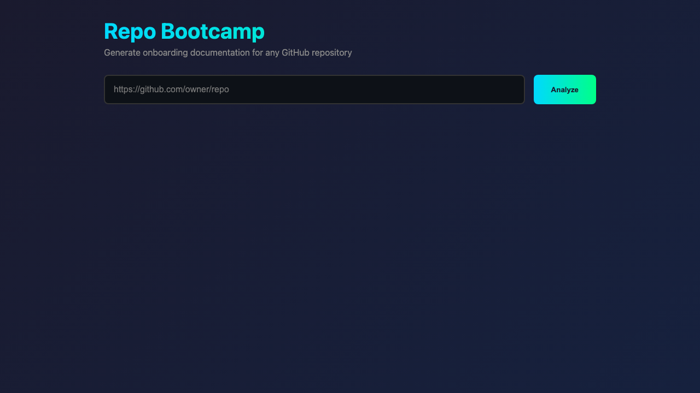

# Repo Bootcamp

<div align="center">

```
╦═╗╔═╗╔═╗╔═╗  ╔╗ ╔═╗╔═╗╔╦╗╔═╗╔═╗╔╦╗╔═╗
╠╦╝║╣ ╠═╝║ ║  ╠╩╗║ ║║ ║ ║ ║  ╠═╣║║║╠═╝
╩╚═╚═╝╩  ╚═╝  ╚═╝╚═╝╚═╝ ╩ ╚═╝╩ ╩╩ ╩╩  
```

**Turn any GitHub, GitLab, or Bitbucket repository into a Day 1 onboarding kit**

[](https://github.com/features/copilot)

### 🏆 One of the Winners of the GitHub Copilot SDK Contest

[](https://github.com/github/copilot-sdk)
[](https://github.com/Arthur742Ramos/repo-bootcamp/actions/workflows/ci.yml)
[](https://www.npmjs.com/package/repo-bootcamp)
[](https://www.npmjs.com/package/repo-bootcamp)
[](https://docs.npmjs.com/generating-provenance-statements)
[](https://codecov.io/gh/Arthur742Ramos/repo-bootcamp)
[](https://nodejs.org/)
[](https://www.typescriptlang.org/)
[](https://opensource.org/licenses/MIT)

[Features](#features) • [Quick Start](#quick-start) • [How It Uses Copilot SDK](#how-it-uses-the-github-copilot-sdk) • [Examples](#example-output)

</div>

---

## The Problem

New developers joining a project waste **days or weeks** trying to understand:
- How do I set up my environment?
- What's the architecture? Where do I start reading?
- What are safe first contributions?
- Who do I ask when I'm stuck?

Most READMEs are outdated. Most wikis are incomplete. Most senior devs are too busy.

## The Solution

**Repo Bootcamp** uses agentic AI to analyze repositories from GitHub, GitLab, or Bitbucket and generate comprehensive, actionable onboarding documentation in **under 60 seconds**.

```bash
npx repo-bootcamp https://github.com/facebook/react
```

That's it. You get 14+ interconnected markdown files covering everything a new contributor needs.

<div align="center">

https://github.com/Arthur742Ramos/repo-bootcamp/raw/main/media/demo-sonnet.mp4

*Generate comprehensive onboarding docs in under 60 seconds*

</div>

<details>
<summary><b>See CLI in action</b></summary>

```
  ╦═╗╔═╗╔═╗╔═╗  ╔╗ ╔═╗╔═╗╔╦╗╔═╗╔═╗╔╦╗╔═╗
  ╠╦╝║╣ ╠═╝║ ║  ╠╩╗║ ║║ ║ ║ ║  ╠═╣║║║╠═╝
  ╩╚═╚═╝╩  ╚═╝  ╚═╝╚═╝╚═╝ ╩ ╚═╝╩ ╩╩ ╩╩  
  
  Turn any repo into a Day 1 onboarding kit

──────────────────────────────────────────────────
  Repository:  https://github.com/sindresorhus/ky
  Branch:      default
  Focus:       all
  Audience:    backend
  Style:       OSS (Community-friendly)
──────────────────────────────────────────────────

✔ Cloned sindresorhus/ky (branch: main)
✔ Scanned 45 files (12 key files read)

Detected Stack:
  Languages:  TypeScript
  Frameworks: None
  Build:      npm
  CI:         Yes
  Docker:     No

✔ Analysis complete

Security Score: 85/100 (B)
Onboarding Risk: 18/100 (A) 🟢

  ╔══════════════════════════════════════════════════════╗
  ║        ✓ Bootcamp Generated Successfully!            ║
  ╚══════════════════════════════════════════════════════╝

  📁 Output: ./bootcamp-ky/

  Generated files:
  ├── BOOTCAMP.md      → 1-page overview (start here!)
  ├── ONBOARDING.md    → Full setup guide
  ├── ARCHITECTURE.md  → System design & diagrams
  ├── CODEMAP.md       → Directory tour
  ├── FIRST_TASKS.md   → Starter issues
  ├── RUNBOOK.md       → Operations guide
  ├── DEPENDENCIES.md  → Dependency graph
  ├── SECURITY.md      → Security findings
  ├── RADAR.md         → Tech radar & risk score
  ├── IMPACT.md        → Change impact analysis
  ├── METRICS.md       → Codebase metrics & hotspots
  ├── HEALTH.md        → Onboarding-readiness health check
  ├── diagrams.mmd     → Mermaid diagrams
  └── repo_facts.json  → Structured data

  🚀 Next step: open ./bootcamp-ky/BOOTCAMP.md
```

</details>

## Why This Tool Wins

| Traditional Approach | Repo Bootcamp |
|---------------------|---------------|
| Manual documentation takes days | Generated in < 60 seconds |
| Gets outdated immediately | Regenerate anytime |
| Inconsistent quality | Structured, validated output |
| Requires deep knowledge | Works on any public repo |
| Static documents | Interactive Q&A mode |
| No security insights | Built-in security analysis |

### What Makes It Different

1. **Powered by GitHub Copilot SDK** - Leverages the official SDK for agentic AI with tool-calling
2. **Truly Agentic** - Claude autonomously explores codebases, not just template filling
3. **Schema Validated** - All output is validated with Zod schemas and auto-retried on failures
4. **Production Ready** - 1,000+ tests, TypeScript, proper error handling
5. **Full Feature Set** - Interactive mode, web UI, docs drift analyzer, cache management, version diffing
6. **Beautiful Output** - Mermaid diagrams, structured markdown, professional formatting

### By the Numbers

| Metric | Value |
|--------|-------|
| GitHub stars | 29 |
| Generated files | 14+ |
| Test suite | 1,000+ tests |
| Source files | 51 TypeScript modules |
| Test files | 76 Vitest files |
| Lines of code | 13,381 TypeScript LOC (src/) |
| Languages supported | 10+ |
| Generation time | < 60 seconds |

## How It Uses the GitHub Copilot SDK

Repo Bootcamp is a showcase of the **GitHub Copilot SDK's agentic capabilities**. Here's how we leverage the SDK:

### Agentic Tool Calling

The SDK enables Claude to autonomously explore repositories using custom tools:

```typescript
import { CopilotClient } from "@github/copilot-sdk";

const client = new CopilotClient();

// Define tools the agent can use
const tools = [
  {
    name: "read_file",
    description: "Read contents of a file in the repository",
    parameters: { path: { type: "string" } }
  },
  {
    name: "list_files", 
    description: "List files matching a glob pattern",
    parameters: { pattern: { type: "string" } }
  },
  {
    name: "search",
    description: "Search for text across the codebase",
    parameters: { query: { type: "string" } }
  }
];

// Agent autonomously decides which files to read
const session = await client.createSession({
  model: "claude-opus-4-5",
  systemMessage: { content: systemPrompt },
  tools,
  streaming: true,
});

await session.sendAndWait({ prompt: analysisPrompt });
```

### Why This Matters

| Traditional LLM Approach | Copilot SDK Agentic Approach |
|--------------------------|------------------------------|
| Dump entire codebase into context | Agent selectively reads relevant files |
| Context window limits scalability | Works on repos of any size |
| Static, one-shot analysis | Dynamic, multi-turn exploration |
| No ability to search or drill down | Agent searches, reads, and follows references |

### Key SDK Features Used

1. **Multi-turn Conversations** - Agent iterates until it has enough information
2. **Tool Calling** - Custom tools for file reading, searching, and metadata
3. **Model Selection** - Automatic fallback through claude-opus-4-5 → claude-sonnet-4-5
4. **Streaming** - Real-time progress updates during analysis
5. **Schema Validation** - Zod schemas validate output, with auto-retry on failures

### Architecture Integration

```
┌─────────────────────────────────────────────────────────────┐
│                   GitHub Copilot SDK                         │
│  ┌─────────────┐  ┌─────────────┐  ┌─────────────────────┐  │
│  │   Claude    │  │   Tools     │  │   Streaming         │  │
│  │   Models    │  │   System    │  │   Responses         │  │
│  └──────┬──────┘  └──────┬──────┘  └──────────┬──────────┘  │
└─────────┼────────────────┼─────────────────────┼────────────┘
          │                │                     │
          ▼                ▼                     ▼
┌─────────────────────────────────────────────────────────────┐
│                    Repo Bootcamp Agent                       │
│                                                              │
│  "Read package.json" → "Search for test files" →            │
│  "Read src/index.ts" → "Find CI workflow" →                  │
│  "Generate structured onboarding JSON"                       │
└─────────────────────────────────────────────────────────────┘
```

The Copilot SDK transforms what would be a simple template-filler into an intelligent agent that understands code structure, identifies patterns, and produces genuinely useful onboarding documentation.

## Features

- **GitHub Copilot SDK Integration** - Built on the official SDK for agentic AI capabilities
- **Agentic Analysis** - Claude autonomously reads files, searches code, and understands architecture
- **Streaming LLM Output** - Streams assistant deltas live to terminal output (verbose) or progress callbacks
- **Multi-host Repository Support** - Works with GitHub, GitLab, and Bitbucket repository URLs
- **Complete Documentation Suite** - Generates 14+ interconnected markdown files
- **Smart Prioritization** - Intelligently samples files based on importance and byte budget
- **Fast File Walking** - Uses concurrent `fast-glob` traversal while honoring skip directories and file limits
- **Schema Validation** - Validates LLM output with auto-retry on failures
- **Model-aware Fast Mode Budgets** - Adjusts inline key-file/entrypoint budgets by selected model context window
- **Multi-language Support** - Works with TypeScript, Python, Go, Rust, Java, and more
- **Interactive Q&A Mode** - Chat with the codebase using natural language
- **Docs Drift Analyzer** - Detect stale/mismatched docs with `bootcamp docs --check`, and auto-fix with `--fix`
- **Phase-level Cache Management** - Reuses deps/security/impact analysis phases and supports `bootcamp cache list|prune|clear` (with `--json` listing for scripts)
- **Tech Radar** - Identify modern, stable, legacy, and risky technologies
- **Change Impact Analysis** - Understand how file changes affect the codebase
- **Codebase Metrics & Hotspots** - Deterministic `METRICS.md` with language breakdown, largest-file hotspots, test-to-source ratio, and an Approachability score (0-100 + grade)
- **Repo Health Check** - Deterministic `HEALTH.md` scoring onboarding-readiness across documentation, community, quality, and automation signals (0-100 + grade) with prioritized, actionable recommendations
- **Environment Doctor** - Diagnose Node, git, GitHub CLI/auth, mermaid-cli, and cache health with `bootcamp doctor` (`--json` for CI)
- **Version & PR Comparison** - Compare refs with `--compare` or analyze pull requests with `bootcamp diff`
- **Auto-Issue Creator** - Generate GitHub issues from starter tasks
- **Web Demo Server** - Beautiful browser UI for analyzing repositories
- **Template Packs** - Customize output style for different contexts
- **Diagram Rendering** - Convert Mermaid to SVG/PNG with mermaid-cli
- **Watch Mode** - Re-run analysis automatically when new commits are detected

## Example Output

<details>
<summary><b>BOOTCAMP.md</b> - 1-page overview</summary>

```markdown
# sindresorhus/ky Bootcamp

> Tiny Fetch-based HTTP client with ergonomic helpers, retries, and hooks.

## Quick Facts
| | |
|---|---|
| **Languages** | TypeScript |
| **Frameworks** | None |
| **Build System** | npm |

## Quick Start
1. Install dependencies: npm install
2. Run tests: npm test
3. Build: npm run build

## If You Only Have 30 Minutes
1. Read this document
2. Run `npm install && npm test`
3. Pick a starter task from FIRST_TASKS.md
```

</details>

<details>
<summary><b>ARCHITECTURE.md</b> - System design with diagrams</summary>

```markdown
# Architecture

## Component Diagram

​```mermaid
graph TD
    A[ky.ts] --> B[Ky Class]
    B --> C[request]
    B --> D[retry logic]
    B --> E[hooks]
    C --> F[Response helpers]
​```

## Data Flow
Request → Options Merge → Hooks (before) → Fetch → Retry? → Hooks (after) → Response
```

</details>

<details>
<summary><b>FIRST_TASKS.md</b> - Starter issues by difficulty</summary>

```markdown
# First Tasks

## Beginner Tasks

### 1. Add README badge for Node.js version
- **Files:** README.md
- **Why:** Easy first contribution, improves documentation

### 2. Add test for edge case
- **Files:** test/main.ts
- **Why:** Improves test coverage, low risk

## Intermediate Tasks

### 3. Improve TypeScript types for hooks
- **Files:** source/types/hooks.ts
- **Why:** Better DX, teaches you the hook system
```

</details>

## Generated Documentation

| File | Description |
|------|-------------|
| `BOOTCAMP.md` | 1-page overview - start here! |
| `ONBOARDING.md` | Complete setup guide with commands |
| `ARCHITECTURE.md` | System design with Mermaid diagrams |
| `CODEMAP.md` | Directory tour for navigation |
| `FIRST_TASKS.md` | 8-10 starter issues by difficulty |
| `RUNBOOK.md` | Operations guide (for services) |
| `DEPENDENCIES.md` | Dependency graph and analysis |
| `SECURITY.md` | Security patterns and findings |
| `RADAR.md` | Tech radar and onboarding risk score |
| `IMPACT.md` | Change impact analysis for key files |
| `METRICS.md` | Codebase metrics, hotspots & approachability score |
| `HEALTH.md` | Onboarding-readiness health score & recommendations |
| `DIFF.md` | Version comparison (with `--compare`) |
| `diagrams.mmd` | Mermaid diagram sources |
| `repo_facts.json` | Structured data for automation |

## Quick Start

```bash
# Clone and install
git clone https://github.com/your-username/repo-bootcamp.git
cd repo-bootcamp
npm install

# Build
npm run build

# Generate bootcamp for any repo
node dist/cli.js https://github.com/sindresorhus/ky

# Or use with npx (after npm link)
npm link
bootcamp https://github.com/sindresorhus/ky
```

## Usage

### Basic Generation

```bash
# Basic usage
bootcamp <repo-url>

# With options
bootcamp https://github.com/owner/repo \
  --branch main \
  --focus all \
  --audience backend \
  --output ./my-bootcamp \
  --verbose \
  --stats

# Analyze an existing local checkout (no clone)
bootcamp ./path/to/local/repo --no-clone
```

`<repo-url>` can be a GitHub, GitLab, or Bitbucket repository URL.

### Fast Mode

```bash
# Generate bootcamp quickly (~15-30s instead of ~60s)
bootcamp https://github.com/owner/repo --fast

# Fast mode skips tool-calling and inlines key files directly
# Inline file budget adapts to model context window (or use --model to override)
```

### Interactive Q&A Mode

```bash
# Start interactive mode after generation
bootcamp https://github.com/owner/repo --interactive

# Standalone Q&A without full generation
bootcamp ask https://github.com/owner/repo
```

Inside the session, type a question to ask the assistant, or use a slash command: `/help` (command reference), `/files` (list detected files), `/clear` (clear the screen), `/exit` (end the session).

### Version Comparison

```bash
# Compare current HEAD with a tag/branch/commit
bootcamp https://github.com/owner/repo --compare v1.0.0

# See what changed for onboarding (new deps, env vars, commands)
```

### PR Diff Mode

```bash
# Analyze onboarding impact of a pull request
bootcamp diff owner/repo#123

# Or with a PR URL
bootcamp diff https://github.com/owner/repo/pull/123
```

### Watch Mode

```bash
# Re-run analysis when new commits land
bootcamp https://github.com/owner/repo --watch

# Custom polling interval (seconds)
bootcamp https://github.com/owner/repo --watch --watch-interval 60

# Allow destructive hard-reset fallback if fast-forward merge is not possible
bootcamp https://github.com/owner/repo --watch --watch-force
```

### Environment Doctor

```bash
# Check Node, git, GitHub CLI/auth, mermaid-cli, and cache health
bootcamp doctor

# Machine-readable output (exits non-zero if a required check fails)
bootcamp doctor --json
```

### Project Configuration

```bash
# Scaffold a .bootcamprc.json in the current directory
bootcamp init

# Preview the config without writing a file
bootcamp init --print

# Preset a style pack (and/or pick a custom path)
bootcamp init --style corporate --path bootcamp.config.json
```

### Repo Health Check

```bash
# Score a repo's onboarding-readiness (docs, community, quality, automation)
bootcamp health https://github.com/owner/repo

# Works on local paths too
bootcamp health ./my-repo

# Machine-readable output
bootcamp health ./my-repo --json

# CI gate: exit non-zero when the score is below the minimum (default 70)
bootcamp health ./my-repo --check --min-score 80
```

### Codebase Metrics

```bash
# Report languages, size, hotspots, and an approachability score
bootcamp metrics https://github.com/owner/repo

# Works on local paths too
bootcamp metrics ./my-repo

# Machine-readable output
bootcamp metrics ./my-repo --json

# CI gate: exit non-zero when approachability is below the minimum (default 70)
bootcamp metrics ./my-repo --check --min-score 75
```

### Auto-Create GitHub Issues

```bash
# Preview issues that would be created
bootcamp https://github.com/owner/repo --create-issues --dry-run

# Actually create issues (requires gh CLI authenticated)
bootcamp https://github.com/owner/repo --create-issues
```

### Web Demo Server

```bash
# Start the web UI
bootcamp web

# Or with custom port
bootcamp web --port 8080

# Then open http://localhost:3000 in your browser
```

The browser UI streams live progress, then lets you preview each generated file in a modal with one-click **Copy** (to clipboard) and **Download** buttons.



The web interface allows you to analyze repositories interactively through your browser.

### Template Packs

```bash
# Use different output styles
bootcamp https://github.com/owner/repo --style corporate  # Formal, comprehensive
bootcamp https://github.com/owner/repo --style startup    # Fast, casual, emoji
bootcamp https://github.com/owner/repo --style oss        # Community-friendly (default)
bootcamp https://github.com/owner/repo --style academic   # Technical, research-oriented
bootcamp https://github.com/owner/repo --style minimal    # Lean and concise
```

### Diagram Rendering

```bash
# Render Mermaid diagrams to SVG (requires @mermaid-js/mermaid-cli)
bootcamp https://github.com/owner/repo --render-diagrams

# Render to PNG format
bootcamp https://github.com/owner/repo --render-diagrams png

# Install mermaid-cli globally
npm install -g @mermaid-js/mermaid-cli
```

## CLI Options

| Option | Description | Default |
|--------|-------------|---------|
| `-b, --branch <branch>` | Branch to analyze | default branch |
| `-f, --focus <focus>` | Focus: onboarding, architecture, contributing, all | `all` |
| `-a, --audience <type>` | Target: all, backend, frontend, sre | `all` |
| `-o, --output <dir>` | Output directory | `./bootcamp-{repo}` |
| `--format <format>` | Output format: markdown, html, pdf | `markdown` |
| `-m, --max-files <n>` | Maximum files to scan | `200` |
| `--model <model>` | Override model selection | auto |
| `-s, --style <style>` | Output style: corporate, startup, oss, academic, minimal | `oss` |
| `-i, --interactive` | Start Q&A mode after generation | false |
| `--transcript` | Save Q&A session to TRANSCRIPT.md | false |
| `-c, --compare <ref>` | Compare with git ref, generate DIFF.md | - |
| `--create-issues` | Create GitHub issues from FIRST_TASKS | false |
| `--dry-run` | Preview issues without creating | false |
| `--render-diagrams [format]` | Render Mermaid to SVG/PNG (requires mermaid-cli) | `svg` |
| `--json-only` | Only generate repo_facts.json | false |
| `--no-clone` | Use a local directory path instead of cloning | false |
| `--fast` | Fast mode: inline key files, skip tools, much faster (~15-30s) | false |
| `--keep-temp` | Keep temporary clone | false |
| `-w, --watch` | Watch mode: re-run analysis on new commits | false |
| `--watch-interval <seconds>` | Polling interval for watch mode in seconds | `30` |
| `--watch-force` | Allow destructive `git reset --hard` fallback in watch mode | false |
| `--stats` | Show detailed statistics | false |
| `-v, --verbose` | Show tool calls and reasoning | false |
| `-q, --quiet` | Suppress banner/progress; print only the output path (scripting/CI) | false |

## Commands

| Command | Description |
|---------|-------------|
| `bootcamp <url>` | Generate full bootcamp documentation |
| `bootcamp ask <url>` | Interactive Q&A without full generation |
| `bootcamp diff <owner/repo#pr>` | Generate onboarding diff for a PR |
| `bootcamp web` | Start local web demo server |
| `bootcamp docs <url>` | Analyze documentation drift (`--check`, `--fix`) |
| `bootcamp health <url>` | Score onboarding-readiness (`--json`, `--check`, `--min-score`) |
| `bootcamp metrics <url>` | Report codebase metrics & approachability (`--json`, `--check`, `--min-score`) |
| `bootcamp init` | Scaffold a `.bootcamprc.json` config (`--force`, `--print`, `--style`) |
| `bootcamp styles` | List the built-in style packs and the sections each enables (`--json`) |
| `bootcamp doctor` | Diagnose your environment (`--json`) |
| `bootcamp completion <shell>` | Print a shell completion script (bash, zsh, fish) |
| `bootcamp cache list\|prune\|clear` | Manage the analysis cache |

## Programmatic API

```ts
import { analyzeRepo, generateBootcamp } from "repo-bootcamp";
import { runParallelAnalysis } from "repo-bootcamp/api";
import { extractDependencies, analyzeSecurityPatterns } from "repo-bootcamp/lib";
```

```js
const { generateBootcamp } = require("repo-bootcamp");
const { extractDependencies } = require("repo-bootcamp/lib");
```

Use `repo-bootcamp/api` for curated core exports and `repo-bootcamp/lib` for the broader module surface.

## Architecture

```
┌─────────────────────────────────────────────────────────────┐
│                      CLI (cli.ts)                           │
│  Parses args, orchestrates flow, displays progress          │
└─────────────────────────────────────────────────────────────┘
                              │
           ┌──────────────────┼──────────────────┐
           ▼                  ▼                  ▼
┌─────────────────┐  ┌─────────────────┐  ┌─────────────────┐
│   Ingest        │  │   Agent         │  │   Generator     │
│   (ingest.ts)   │  │   (agent.ts)    │  │   (generator.ts)│
│                 │  │                 │  │                 │
│ • Clone repo    │  │ • Copilot SDK   │  │ • BOOTCAMP.md   │
│ • Scan files    │  │ • Tool calling  │  │ • ONBOARDING.md │
│ • Detect stack  │  │ • Model fallback│  │ • ARCHITECTURE  │
│ • Read configs  │  │ • Schema valid. │  │ • And more...   │
└─────────────────┘  └─────────────────┘  └─────────────────┘
                              │
        ┌─────────────────────┼─────────────────────┐
        ▼                     ▼                     ▼
┌──────────────┐    ┌──────────────┐    ┌──────────────────┐
│   Analyzers  │    │   Web/CLI    │    │   Integrations   │
│              │    │              │    │                  │
│ • radar.ts   │    │ • web/server.ts │    │ • issues.ts      │
│ • impact.ts  │    │ • interactive│    │ • diff.ts        │
│ • security.ts│    │ • plugins.ts │    │ • deps.ts        │
└──────────────┘    └──────────────┘    └──────────────────┘
```

### Architecture Decision Records

Key architecture decisions are documented in [docs/adr/](./docs/adr/), including decisions around Copilot SDK usage, Express, cache design, and plugin architecture.

## How It Works

1. **Clone & Scan** - Shallow clones the repo, scans file tree, detects stack
2. **Priority Sampling** - Scores files by importance, reads within byte budget
3. **Agentic Analysis** - Claude explores the repo with tools, streams response deltas, produces JSON
4. **Schema Validation** - Validates output, retries with targeted prompts if needed
5. **Extended Analysis** - Tech radar, security scan, dependency graph, impact map (with phase-level cache reuse)
6. **Generate Docs** - Transforms JSON into polished markdown documentation

## Configuration

### .bootcamprc / bootcamp.config.ts

Create a `.bootcamprc` or `bootcamp.config.ts` in your project root for custom settings and defaults:

Supported config files include `.bootcamprc`, `.bootcamprc.{json,yaml,yml,js,ts}`, `bootcamp.config.{json,js,ts}`, and `.bootcamp.json`.
Option precedence is: explicit CLI flag > config `defaults` > built-in defaults.

```ts
export default {
  defaults: {
    audience: "all",
    focus: "all",
    style: "oss",
    model: "claude-sonnet-4-5",
    maxFiles: 200
  },
  customStyle: {
    emoji: true,
    firstTasksCount: 10
  },
  plugins: [],
  prompts: {
    system: "You are a helpful assistant for onboarding developers."
  },
  output: {
    excludeDocs: ["RUNBOOK.md"]
  }
};
```

### .bootcamp-prompts.md

Add a `.bootcamp-prompts.md` file to the target repository to guide the analysis and interactive agents with repo-specific instructions (e.g., focus areas, terminology, tone).
The contents are appended to the analysis prompt and interactive system prompt (max 8KB).

You can also specify an external prompts file with `--repo-prompts <path>`:

```bash
bootcamp https://github.com/owner/repo --repo-prompts ./my-prompts.md
```

Example `.bootcamp-prompts.md`:

```markdown
## Focus Areas
- Pay special attention to the plugin architecture in src/plugins/
- The event bus in src/events/ is central to the system

## Terminology
- "Widget" refers to UI components in our domain
- "Pipeline" is our term for the data processing chain

## Onboarding Notes
- New developers should start with the src/core/ module
- Ignore the legacy/ directory — it is scheduled for removal
```

### Plugin System

Extend Repo Bootcamp with custom analyzers:

Plugins can hook into three stages:
- **Analyzer plugins** via `analyze(...)` (enrich facts and add docs)
- **Formatter plugins** via `formatDocuments(...)` (transform generated docs)
- **Output target plugins** via `writeOutput(...)` (publish/store outputs elsewhere)

```typescript
// my-plugin.ts
export default {
  name: "my-plugin",
  version: "1.0.0",
  analyze: async (repoPath, scanResult, facts, options) => {
    // Your custom analysis
    return {
      docs: [{ name: "CUSTOM.md", content: "..." }],
      extraData: { customMetric: 42 },
    };
  },
};
```

## Example Outputs

See the [examples/](./examples/) directory for full sample outputs:

- [examples/ky/](./examples/ky/) - TypeScript HTTP client library (sindresorhus/ky)

## Development

```bash
# Install dependencies
npm install

# Build
npm run build

# Lint + type-check
npm run lint
npm run typecheck

# Run tests (1,000+ tests)
npm test

# Check formatting (or apply it)
npm run format:check
npm run format

# Watch mode
npm run test:watch

# Web server hot-reload
npm run dev:web

# Coverage (enforces lines >= 80%, branches >= 70%)
npm run test:coverage
```

### CI Quality Gates

- Test matrix runs on Node.js 20, 22, and 24.
- CI separates `lint`, `typecheck`, and `test` checks.
- Pull requests run dependency review scanning.
- CI generates and uploads an SPDX SBOM artifact (`sbom.spdx.json`).
- Coverage is uploaded from the Node 20 lane and validated with Vitest thresholds.

## Requirements

- Node.js 20+
- GitHub Copilot SDK access (requires GitHub Copilot subscription)
- `GITHUB_TOKEN` environment variable for API authentication (provided by Copilot SDK)
- `gh` CLI (optional, for `--create-issues`)

## Model Configuration

The tool uses these models in order of preference:
1. `claude-opus-4-5`
2. `claude-sonnet-4-5`
3. `claude-sonnet-4-20250514`

Set `--model` to override.

## Tech Stack

- **Runtime:** Node.js 20+
- **Language:** TypeScript 5.6
- **AI:** GitHub Copilot SDK with Claude
- **Testing:** Vitest (1,000+ tests)
- **CLI:** Commander.js
- **Validation:** Zod schemas
- **Web:** Express 5 with SSE

## Contributing

Contributions are welcome! Please:

1. Fork the repository
2. Create a feature branch
3. Open a bug/feature issue using the GitHub issue forms if needed
4. Run `npm run lint && npm run build && npm test`
5. Submit a pull request (the PR template will guide the checklist)

## License

MIT

---

<div align="center">

### 🏆 Built for the GitHub Copilot SDK Challenge

**[Repo Bootcamp](https://github.com/Arthur742Ramos/repo-bootcamp)** showcases the power of the [GitHub Copilot SDK](https://github.com/github/copilot-sdk) for building agentic developer tools.

*Stop wasting time on manual onboarding docs. Let AI do the heavy lifting.*

[](https://github.com/github/copilot-sdk)

</div>
