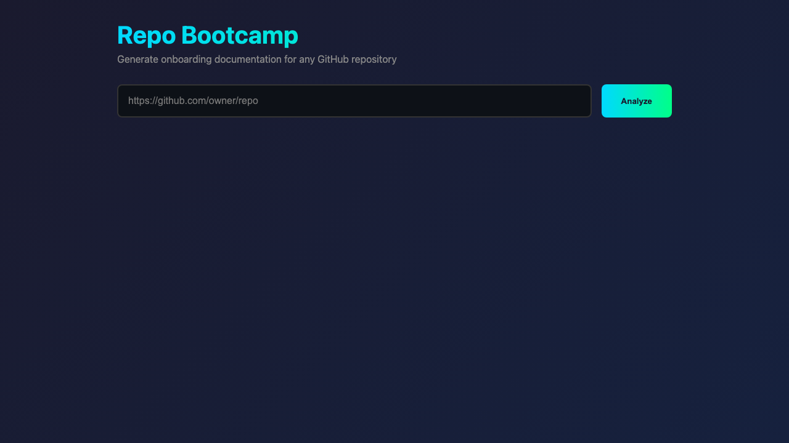

# Repo Bootcamp

<div align="center">

```
╦═╗╔═╗╔═╗╔═╗  ╔╗ ╔═╗╔═╗╔╦╗╔═╗╔═╗╔╦╗╔═╗
╠╦╝║╣ ╠═╝║ ║  ╠╩╗║ ║║ ║ ║ ║  ╠═╣║║║╠═╝
╩╚═╚═╝╩  ╚═╝  ╚═╝╚═╝╚═╝ ╩ ╚═╝╩ ╩╩ ╩╩
```

**Turn any GitHub, GitLab, or Bitbucket repository into a Day 1 onboarding kit**

[](https://github.com/features/copilot)

### 🏆 One of the Winners of the GitHub Copilot SDK Contest

[](https://github.com/github/copilot-sdk)
[](https://github.com/Arthur742Ramos/repo-bootcamp/actions/workflows/ci.yml)
[](https://www.npmjs.com/package/repo-bootcamp)
[](https://www.npmjs.com/package/repo-bootcamp)
[](https://docs.npmjs.com/generating-provenance-statements)
[](https://codecov.io/gh/Arthur742Ramos/repo-bootcamp)
[](https://nodejs.org/)
[](https://www.typescriptlang.org/)
[](https://opensource.org/licenses/MIT)

[Features](#features) • [Quick Start](#quick-start) • [How It Uses Copilot SDK](#how-it-uses-the-github-copilot-sdk) • [Examples](#example-output)

</div>

---

<details>
<summary><b>Table of contents</b></summary>

- [The Problem](#the-problem) · [The Solution](#the-solution) · [Why This Tool Wins](#why-this-tool-wins)
- [How It Uses the GitHub Copilot SDK](#how-it-uses-the-github-copilot-sdk) · [Features](#features)
- [Example Output](#example-output) · [Generated Documentation](#generated-documentation)
- [Quick Start](#quick-start) · [Usage](#usage) · [CLI Options](#cli-options) · [Commands](#commands)
- [Programmatic API](#programmatic-api) · [Architecture](#architecture) · [How It Works](#how-it-works)
- [Configuration](#configuration) · [Development](#development) · [Requirements](#requirements)
- [Model Configuration](#model-configuration) · [Tech Stack](#tech-stack) · [Contributing](#contributing) · [License](#license)

</details>

---

## The Problem

New developers joining a project waste **days or weeks** trying to understand:

- How do I set up my environment?
- What's the architecture? Where do I start reading?
- What are safe first contributions?
- Who do I ask when I'm stuck?

Most READMEs are outdated. Most wikis are incomplete. Most senior devs are too busy.

## The Solution

**Repo Bootcamp** uses agentic AI to analyze repositories from GitHub, GitLab, or Bitbucket and generate comprehensive, actionable onboarding documentation in **under 60 seconds**.

```bash
npx repo-bootcamp https://github.com/facebook/react
```

That's it. You get 14+ interconnected markdown files covering everything a new contributor needs.

<div align="center">

https://github.com/Arthur742Ramos/repo-bootcamp/raw/main/media/demo-sonnet.mp4

_Generate comprehensive onboarding docs in under 60 seconds_

</div>

<details>
<summary><b>See CLI in action</b></summary>

```
  ╦═╗╔═╗╔═╗╔═╗  ╔╗ ╔═╗╔═╗╔╦╗╔═╗╔═╗╔╦╗╔═╗
  ╠╦╝║╣ ╠═╝║ ║  ╠╩╗║ ║║ ║ ║ ║  ╠═╣║║║╠═╝
  ╩╚═╚═╝╩  ╚═╝  ╚═╝╚═╝╚═╝ ╩ ╚═╝╩ ╩╩ ╩╩

  Turn any repo into a Day 1 onboarding kit

──────────────────────────────────────────────────
  Repository:  https://github.com/sindresorhus/ky
  Branch:      default
  Focus:       all
  Audience:    backend
  Style:       OSS (Community-friendly)
──────────────────────────────────────────────────

✔ Cloned sindresorhus/ky (branch: main)
✔ Scanned 45 files (12 key files read)

Detected Stack:
  Languages:  TypeScript
  Frameworks: None
  Build:      npm
  CI:         Yes
  Docker:     No

✔ Analysis complete

Security Score: 85/100 (B)
Onboarding Risk: 18/100 (A) 🟢

  ╔══════════════════════════════════════════════════════╗
  ║        ✓ Bootcamp Generated Successfully!            ║
  ╚══════════════════════════════════════════════════════╝

  📁 Output: ./bootcamp-ky/

  Generated files:
  ├── BOOTCAMP.md      → 1-page overview (start here!)
  ├── ONBOARDING.md    → Full setup guide
  ├── ARCHITECTURE.md  → System design & diagrams
  ├── CODEMAP.md       → Directory tour
  ├── FIRST_TASKS.md   → Starter issues
  ├── RUNBOOK.md       → Operations guide
  ├── DEPENDENCIES.md  → Dependency graph
  ├── SECURITY.md      → Security findings
  ├── RADAR.md         → Tech radar & risk score
  ├── IMPACT.md        → Change impact analysis
  ├── METRICS.md       → Codebase metrics & hotspots
  ├── HEALTH.md        → Onboarding-readiness health check
  ├── diagrams.mmd     → Mermaid diagrams
  ├── repo_facts.json  → Structured data
  ├── summary.json     → Scores & emitted files
  └── ANALYSIS_MANIFEST.json → Run metadata and evidence map

  🚀 Next step: open ./bootcamp-ky/BOOTCAMP.md
```

</details>

## Why This Tool Wins

| Traditional Approach            | Repo Bootcamp                |
| ------------------------------- | ---------------------------- |
| Manual documentation takes days | Generated in < 60 seconds    |
| Gets outdated immediately       | Regenerate anytime           |
| Inconsistent quality            | Structured, validated output |
| Requires deep knowledge         | Works on any public repo     |
| Static documents                | Interactive Q&A mode         |
| No security insights            | Built-in security analysis   |

### What Makes It Different

1. **Powered by GitHub Copilot SDK** - Leverages the official SDK for agentic AI with tool-calling
2. **Truly Agentic** - Claude autonomously explores codebases, not just template filling
3. **Schema Validated** - All output is validated with Zod schemas and auto-retried on failures
4. **Production Ready** - 1,270+ tests, TypeScript, proper error handling
5. **Full Feature Set** - A 22-command CLI: interactive Q&A, a combined scan dashboard, health/metrics/security scoring, coupling & impact graphs, machine preflight, ownership maps, cross-ecosystem task discovery, docs-drift analysis, guarded kit publishing, and a web UI
6. **Beautiful Output** - Mermaid diagrams, structured markdown, professional formatting

### By the Numbers

| Metric              | Value                        |
| ------------------- | ---------------------------- |
| Generated files     | 14+                          |
| Test suite          | 1,270+ tests                 |
| Source files        | 59 TypeScript modules        |
| Test files          | 102 Vitest files             |
| Lines of code       | 18,326 TypeScript LOC (src/) |
| Languages supported | 10+                          |
| Generation time     | < 60 seconds                 |

## How It Uses the GitHub Copilot SDK

Repo Bootcamp is a showcase of the **GitHub Copilot SDK's agentic capabilities**. Here's how we leverage the SDK:

### Agentic Tool Calling

The SDK enables Claude to autonomously explore repositories using custom tools:

```typescript
import { CopilotClient } from "@github/copilot-sdk";

const client = new CopilotClient();

// Define tools the agent can use
const tools = [
  {
    name: "read_file",
    description: "Read contents of a file in the repository",
    parameters: { path: { type: "string" } },
  },
  {
    name: "list_files",
    description: "List files matching a glob pattern",
    parameters: { pattern: { type: "string" } },
  },
  {
    name: "search",
    description: "Search for text across the codebase",
    parameters: { query: { type: "string" } },
  },
];

// Agent autonomously decides which files to read
const session = await client.createSession({
  model: "claude-opus-4-5",
  systemMessage: { content: systemPrompt },
  tools,
  streaming: true,
});

await session.sendAndWait({ prompt: analysisPrompt });
```

### Why This Matters

| Traditional LLM Approach           | Copilot SDK Agentic Approach                  |
| ---------------------------------- | --------------------------------------------- |
| Dump entire codebase into context  | Agent selectively reads relevant files        |
| Context window limits scalability  | Works on repos of any size                    |
| Static, one-shot analysis          | Dynamic, multi-turn exploration               |
| No ability to search or drill down | Agent searches, reads, and follows references |

### Key SDK Features Used

1. **Multi-turn Conversations** - Agent iterates until it has enough information
2. **Tool Calling** - Custom tools for file reading, searching, and metadata
3. **Model Selection** - Automatic fallback through claude-opus-4-5 → claude-sonnet-4-5
4. **Streaming** - Real-time progress updates during analysis
5. **Schema Validation** - Zod schemas validate output, with auto-retry on failures

### Architecture Integration

```
┌─────────────────────────────────────────────────────────────┐
│                   GitHub Copilot SDK                         │
│  ┌─────────────┐  ┌─────────────┐  ┌─────────────────────┐  │
│  │   Claude    │  │   Tools     │  │   Streaming         │  │
│  │   Models    │  │   System    │  │   Responses         │  │
│  └──────┬──────┘  └──────┬──────┘  └──────────┬──────────┘  │
└─────────┼────────────────┼─────────────────────┼────────────┘
          │                │                     │
          ▼                ▼                     ▼
┌─────────────────────────────────────────────────────────────┐
│                    Repo Bootcamp Agent                       │
│                                                              │
│  "Read package.json" → "Search for test files" →            │
│  "Read src/index.ts" → "Find CI workflow" →                  │
│  "Generate structured onboarding JSON"                       │
└─────────────────────────────────────────────────────────────┘
```

The Copilot SDK transforms what would be a simple template-filler into an intelligent agent that understands code structure, identifies patterns, and produces genuinely useful onboarding documentation.

## Features

- **GitHub Copilot SDK Integration** - Built on the official SDK for agentic AI capabilities
- **Agentic Analysis** - Claude autonomously reads files, searches code, and understands architecture
- **Streaming LLM Output** - Streams assistant deltas live to terminal output (verbose) or progress callbacks
- **Multi-host Repository Support** - Works with GitHub, GitLab, and Bitbucket repository URLs
- **Complete Documentation Suite** - Generates 14+ interconnected markdown files
- **Smart Prioritization** - Intelligently samples files based on importance and byte budget
- **Fast File Walking** - Uses concurrent `fast-glob` traversal while honoring skip directories and file limits
- **Schema Validation** - Validates LLM output with auto-retry on failures
- **Model-aware Fast Mode Budgets** - Adjusts inline key-file/entrypoint budgets by selected model context window
- **Multi-language Support** - Works with TypeScript, Python, Go, Rust, Java, and more
- **Interactive Q&A Mode** - Chat with the codebase using natural language
- **Docs Drift Analyzer** - Detect stale/mismatched docs with `bootcamp docs --check`, and auto-fix with `--fix`
- **Phase-level Cache Management** - Reuses deps/security/impact analysis phases and supports `bootcamp cache list|prune|clear` (with `--json` listing for scripts)
- **Tech Radar** - Identify modern, stable, legacy, and risky technologies
- **Change Impact Analysis** - Understand how file changes affect the codebase
- **Codebase Metrics & Hotspots** - Deterministic `METRICS.md` with language breakdown, largest-file hotspots, test-to-source ratio, and an Approachability score (0-100 + grade)
- **Repo Health Check** - Deterministic `HEALTH.md` scoring onboarding-readiness across documentation, community, quality, and automation signals (0-100 + grade) with prioritized, actionable recommendations
- **Environment Doctor** - Diagnose Node, git, GitHub CLI/auth, mermaid-cli, and cache health with `bootcamp doctor` (`--json` for CI)
- **Combined Scan Dashboard** - `bootcamp scan` reports health, metrics, security, and onboarding risk from a single clone, with a `--check` CI gate on the lowest score
- **Module Coupling Map** - `bootcamp coupling` ranks modules by import coupling to reveal the load-bearing core, orchestrator hubs, and possibly-orphaned dead code
- **Circular Dependency Detection** - `bootcamp cycles` finds circular import groups (Tarjan SCC) on the import graph, with a `--check` CI gate
- **Machine Preflight** - `bootcamp preflight` checks your machine against the target repo's declared toolchain (Node, package manager, Python, Go) with a per-row remedy
- **Ownership Map** - `bootcamp owners` parses `CODEOWNERS` to answer "who do I ask?" with default owners, per-area maintainers, and top committers
- **Task Discovery** - `bootcamp tasks` answers "how do I build/test/run this?" deterministically across ecosystems (package.json scripts, Makefile, justfile, go-task Taskfile, docker-compose, pyproject/poetry, composer.json, qualifying Cargo manifests), grouped by category with a suggested getting-started sequence (`--json`, `--category`)
- **Style Pack Explorer** - `bootcamp styles` lists the built-in style packs and the doc sections each one enables
- **Version & PR Comparison** - Compare refs with `--compare` or analyze pull requests with `bootcamp diff`
- **Auto-Issue Creator** - Generate GitHub issues from starter tasks
- **Web Demo Server** - Beautiful browser UI for analyzing repositories
- **Template Packs** - Customize output style for different contexts
- **Diagram Rendering** - Convert Mermaid to SVG/PNG with mermaid-cli
- **Watch Mode** - Re-run analysis automatically when new commits are detected

Generated onboarding setup instructions preserve an explicit `install` command from the
analyzed quickstart. Without one, only npm, pnpm, Yarn, and Bun get a conventional install
command; other or unknown tools get guidance to the repository's README or contribution
guide. A package-manager label alone does not establish a runnable installation command.
Within the selected scan root, `poetry.lock` and `uv.lock` identify those Python workflows;
`requirements.txt` or a plain `pyproject.toml` retain the generic `pip` indication. This
does not parse TOML workflow configuration or establish whether Poetry or uv is used
without a lockfile. Poetry can also use standard `[project]` metadata.

Development, testing, and build/verify guidance uses semantic command names or recognized
simple script, task, and runner invocations. Dependency-group arguments and file paths
do not establish a command's role. Unknown or compound shell commands need an explicit
role name to appear in these steps; this is not a general shell parser.

## Example Output

<details>
<summary><b>BOOTCAMP.md</b> - 1-page overview</summary>

```markdown
# sindresorhus/ky Bootcamp

> Tiny Fetch-based HTTP client with ergonomic helpers, retries, and hooks.

## Quick Facts

|                  |            |
| ---------------- | ---------- |
| **Languages**    | TypeScript |
| **Frameworks**   | None       |
| **Build System** | npm        |

## Quick Start

1. Install dependencies: npm install
2. Run tests: npm test
3. Build: npm run build

## If You Only Have 30 Minutes

1. Read this document
2. Run `npm install && npm test`
3. Pick a starter task from FIRST_TASKS.md
```

</details>

<details>
<summary><b>ARCHITECTURE.md</b> - System design with diagrams</summary>

```markdown
# Architecture

## Component Diagram

​`mermaid
graph TD
    A[ky.ts] --> B[Ky Class]
    B --> C[request]
    B --> D[retry logic]
    B --> E[hooks]
    C --> F[Response helpers]
​`

## Data Flow

Request → Options Merge → Hooks (before) → Fetch → Retry? → Hooks (after) → Response
```

</details>

<details>
<summary><b>FIRST_TASKS.md</b> - Starter issues by difficulty</summary>

```markdown
# First Tasks

## Beginner Tasks

### 1. Add README badge for Node.js version

- **Files:** README.md
- **Why:** Easy first contribution, improves documentation

### 2. Add test for edge case

- **Files:** test/main.ts
- **Why:** Improves test coverage, low risk

## Intermediate Tasks

### 3. Improve TypeScript types for hooks

- **Files:** source/types/hooks.ts
- **Why:** Better DX, teaches you the hook system
```

</details>

## Generated Documentation

| File                     | Description                                                          |
| ------------------------ | -------------------------------------------------------------------- |
| `BOOTCAMP.md`            | 1-page overview - start here!                                        |
| `ONBOARDING.md`          | Complete setup guide with commands                                   |
| `ARCHITECTURE.md`        | System design with Mermaid diagrams                                  |
| `CODEMAP.md`             | Directory tour for navigation                                        |
| `FIRST_TASKS.md`         | 8-10 starter issues by difficulty                                    |
| `RUNBOOK.md`             | Operations guide (for services)                                      |
| `DEPENDENCIES.md`        | Dependency graph and analysis                                        |
| `SECURITY.md`            | Security patterns and findings                                       |
| `RADAR.md`               | Tech radar and onboarding risk score                                 |
| `IMPACT.md`              | Change impact analysis for key files, plus any circular dependencies |
| `METRICS.md`             | Codebase metrics, hotspots & approachability score                   |
| `HEALTH.md`              | Onboarding-readiness health score & recommendations                  |
| `DIFF.md`                | Version comparison (with `--compare`)                                |
| `diagrams.mmd`           | Mermaid diagram sources                                              |
| `repo_facts.json`        | Structured data for automation                                       |
| `summary.json`           | Scores and the local files emitted by this run                       |
| `ANALYSIS_MANIFEST.json` | Reproducibility metadata, scan coverage, and evidence sources        |

Optional reports depend on the selected style and available analysis. BOOTCAMP's
generated Next Steps links include only documents in the assembled kit, including
output exclusions and formatter removals. Explicit repository or formatter text
is preserved; a formatter that replaces the navigation owns its links.

The completion file list and `summary.json` inventory describe successful local
writes from the current run, including converted or plugin-provided document
names and run metadata. Existing unrelated files and external output-target
destinations are omitted. Quiet and JSON-only modes keep the detailed list hidden.

## Quick Start

```bash
# Clone and install
git clone https://github.com/your-username/repo-bootcamp.git
cd repo-bootcamp
npm install

# Build
npm run build

# Generate bootcamp for any repo
node dist/cli.js https://github.com/sindresorhus/ky

# Or use with npx (after npm link)
npm link
bootcamp https://github.com/sindresorhus/ky
```

## Usage

### Basic Generation

```bash
# Basic usage
bootcamp <repo-url>

# With options
bootcamp https://github.com/owner/repo \
  --branch main \
  --focus all \
  --audience backend \
  --output ./my-bootcamp \
  --verbose \
  --stats

# Analyze an existing local checkout (no clone)
bootcamp ./path/to/local/repo --no-clone
```

`<repo-url>` can be a GitHub, GitLab, or Bitbucket repository URL.

### Fast Mode

```bash
# Generate bootcamp quickly (~15-30s instead of ~60s)
bootcamp https://github.com/owner/repo --fast

# Fast mode skips tool-calling and inlines key files directly
# Inline file budget adapts to model context window (or use --model to override)
```

### Interactive Q&A Mode

```bash
# Start interactive mode after generation
bootcamp https://github.com/owner/repo --interactive

# Standalone Q&A without full generation
bootcamp ask https://github.com/owner/repo
```

Inside the session, type a question to ask the assistant, or use a slash command: `/help` (command reference), `/files` (list detected files), `/clear` (clear the screen), `/exit` (end the session).

### Version Comparison

```bash
# Compare current HEAD with a tag/branch/commit
bootcamp https://github.com/owner/repo --compare v1.0.0

# See what changed for onboarding (new deps, env vars, commands)
```

### PR Diff Mode

Diff guidance compares the common ancestor of the requested refs with the head, so files,
dependencies, scripts, and version changes describe the same feature history. Public ref labels
remain in the report. PR mode starts with the usual shallow clone and deepens only its base/head
histories when needed, with three bounded increases (32, 128, then 512 ancestry levels).
A shallow candidate is accepted only when reachable cutoffs cannot hide a nearer ancestor.
This conservative check can require more history when an incomparable root is reachable.
If ancestry remains incomplete within that budget, retry with `--full-clone`; unrelated histories
fail with a clear error.
Local `--compare` uses available checkout history without fetching it.

```bash
# Analyze onboarding impact of a pull request
bootcamp diff owner/repo#123

# Or with a PR URL
bootcamp diff https://github.com/owner/repo/pull/123
```

Comparison reports preserve literal Git paths, including Unicode and rename/copy destinations. Paths containing control characters use quoted JSON-escaped display labels (for example, `"folder\nname/index.ts"`); programmatic `DiffSummary` file arrays retain the original path characters.

### Watch Mode

```bash
# Re-run analysis when new commits land
bootcamp https://github.com/owner/repo --watch

# Custom polling interval (seconds)
bootcamp https://github.com/owner/repo --watch --watch-interval 60

# Allow destructive hard-reset fallback if fast-forward merge is not possible
bootcamp https://github.com/owner/repo --watch --watch-force
```

Each regenerated kit records the updated commit in `summary.json` and
`ANALYSIS_MANIFEST.json`, and cached phases use that commit identity. Local commits
are detected even when upstream is unchanged; working-tree edits keep phase
caching disabled.

### Environment Doctor

```bash
# Check Node, git, GitHub CLI/auth, mermaid-cli, and cache health
bootcamp doctor

# Machine-readable output (exits non-zero if a required check fails)
bootcamp doctor --json
```

### Project Configuration

```bash
# Scaffold a .bootcamprc.json in the current directory
bootcamp init

# Preview the config without writing a file
bootcamp init --print

# Preset a style pack (and/or pick a custom path)
bootcamp init --style corporate --path bootcamp.config.json
```

### Docs Drift Analyzer

```bash
# Detect stale or mismatched docs (versions, frameworks, CLI flags, badges)
bootcamp docs https://github.com/owner/repo

# Works on local paths too
bootcamp docs ./my-repo

# Auto-fix the stale sections it can repair
bootcamp docs ./my-repo --fix

# Apply available repairs and gate on the remaining issues
bootcamp docs ./my-repo --fix --check

# CI gate: exit non-zero when docs are stale
bootcamp docs ./my-repo --check
```

Flags version mismatches, undocumented frameworks/prerequisites, CLI drift, and
broken badges. Pair `--check` with `--fix` to apply available repairs, then fail
the gate only if issues remain.

### Combined Scan

```bash
# Clone once, then report health + metrics + security + onboarding risk in one dashboard
bootcamp scan https://github.com/owner/repo

# Works on local paths too
bootcamp scan ./my-repo

# Machine-readable output (all reports plus a score summary)
bootcamp scan ./my-repo --json

# CI gate: exit non-zero when the lowest of the three scores is below the minimum
bootcamp scan ./my-repo --check --min-score 70
```

The dashboard also includes the tech-radar **onboarding-risk** score (0-100,
lower is better) alongside health/metrics/security. The `--check` gate stays on
the lowest of the three higher-is-better scores (onboarding risk is reported but
not gated, since for it lower is better).

### Continuous Onboarding Quality

This repository includes a ready-to-copy GitHub Actions workflow at
`.github/workflows/onboarding-quality.yml`. It builds Repo Bootcamp, runs the
deterministic `scan` dashboard on every push and pull request, fails when the
minimum score is missed, and uploads the machine-readable report as an artifact.
It does not require a Copilot token or make an AI call.

### Publishing a Generated Kit

Use the publish command to inspect or apply generated files to a clean checkout.
It previews the exact branch, files, and commit by default:

```bash
bootcamp publish ./my-repo ./.bootcamp-output/job/repo

# Explicitly create a branch, copy the kit, and commit it
bootcamp publish ./my-repo ./.bootcamp-output/job/repo --apply --branch bootcamp/onboarding-refresh

# Push the branch and open a GitHub pull request (requires gh auth)
bootcamp publish ./my-repo ./.bootcamp-output/job/repo --create-pr --base main
```

Publishing refuses to mutate a dirty checkout and only accepts known generated
artifact types. Review `ANALYSIS_MANIFEST.json` before opening the pull request.

### Repo Health Check

```bash
# Score a repo's onboarding-readiness (docs, community, quality, automation)
bootcamp health https://github.com/owner/repo

# Works on local paths too
bootcamp health ./my-repo

# Machine-readable output
bootcamp health ./my-repo --json

# CI gate: exit non-zero when the score is below the minimum (default 70)
bootcamp health ./my-repo --check --min-score 80
```

### Codebase Metrics

```bash
# Report languages, size, hotspots, and an approachability score
bootcamp metrics https://github.com/owner/repo

# Works on local paths too
bootcamp metrics ./my-repo

# Machine-readable output
bootcamp metrics ./my-repo --json

# CI gate: exit non-zero when approachability is below the minimum (default 70)
bootcamp metrics ./my-repo --check --min-score 75
```

### Security Analysis

```bash
# Analyze security patterns, protections, and score a repo
bootcamp security https://github.com/owner/repo

# Works on local paths too
bootcamp security ./my-repo

# Machine-readable output (findings, protections, deps, score)
bootcamp security ./my-repo --json

# CI gate: exit non-zero when the security score is below the minimum (default 70)
bootcamp security ./my-repo --check --min-score 80
```

### Dependency Report

```bash
# Detect the package manager and report dependencies grouped by category
bootcamp deps https://github.com/owner/repo

# Works on local paths too
bootcamp deps ./my-repo

# Machine-readable output (counts, categories, full lists)
bootcamp deps ./my-repo --json

# Emit the Mermaid dependency graph (pipe into a renderer or a Markdown fence)
bootcamp deps ./my-repo --diagram
```

Supports npm, Cargo, pip/Poetry, and Go module manifests.

### Tech Radar & Onboarding Risk

```bash
# Map the stack onto a modern/stable/legacy/risky radar and score onboarding risk
bootcamp radar https://github.com/owner/repo

# Works on local paths too
bootcamp radar ./my-repo

# Machine-readable output (signals + onboarding-risk score, grade, factors)
bootcamp radar ./my-repo --json

# CI gate: exit non-zero when the onboarding-risk score exceeds the maximum
bootcamp radar ./my-repo --check --max-risk 40
```

Onboarding risk is scored 0-100 where **lower is better**, so its gate is
`--max-risk` (fail above the threshold) rather than `--min-score`.

### Change Impact ("Blast Radius")

```bash
# Summarize the impact of the repo's key entry-point files
bootcamp impact https://github.com/owner/repo

# Focus on one file: what does changing it affect?
bootcamp impact ./my-repo src/auth/session.ts

# Machine-readable output (imports, importedBy, affected files/tests/docs)
bootcamp impact ./my-repo src/auth/session.ts --json
```

For a specific file it lists what it imports, what imports it, and the
transitively affected files, tests, and docs. With no file it summarizes
the top key files (use `--top <n>` to widen).

### Module Coupling ("Where Do I Start Reading?")

```bash
# Rank modules by import coupling across the whole repo
bootcamp coupling https://github.com/owner/repo

# Works on local paths too
bootcamp coupling ./my-repo

# Machine-readable output (core, hubs, orphans with fan-in/fan-out)
bootcamp coupling ./my-repo --json
```

Surfaces the **load-bearing core** (modules with the highest fan-in — the
best place to start reading), the **orchestrator hubs** (highest fan-out),
and **possibly-orphaned** modules (isolated in the import graph — candidate
dead code). Use `--top <n>` to widen each section.

### Circular Dependencies

```bash
# Detect circular import groups across the repo
bootcamp cycles https://github.com/owner/repo

# Works on local paths too
bootcamp cycles ./my-repo

# Machine-readable output (cycles with their member files)
bootcamp cycles ./my-repo --json

# CI gate: exit non-zero if any circular dependency exists
bootcamp cycles ./my-repo --check

# Ratchet legacy cycles: allow up to N known groups
bootcamp cycles ./my-repo --check --max-cycles 3
```

Finds **strongly-connected import groups** (modules that mutually depend on
each other, directly or transitively) using Tarjan's algorithm on the same
import graph as `coupling` and `IMPACT.md`. Each cycle is shown as a ring
(`a.ts → b.ts → a.ts`). Test files are excluded. Circular imports are a
common source of fragile load order and hard-to-test modules, so `--check`
makes a useful CI guardrail.

### Preflight ("Can My Machine Build This?")

```bash
# Check YOUR machine against the target repo's declared toolchain
bootcamp preflight https://github.com/owner/repo

# Works on local paths too
bootcamp preflight ./my-repo

# CI gate: exit non-zero if any required tool is missing or mismatched
bootcamp preflight ./my-repo --check
```

Reads the repo's declared toolchain — Node (`engines.node`, `.nvmrc`,
`.node-version`), package manager (`packageManager` / Corepack), Python
(`requires-python`, `.python-version`), and Go (`go.mod`) — and checks each
against your local machine with a per-row remedy. Unlike `bootcamp doctor`
(which checks whether _your_ machine can run bootcamp itself), `preflight`
checks your machine against the _target_ repo's requirements. Version checks honor
all whitespace- or comma-separated bounds (for example, `>=20 <23`) and
`||` alternatives (for example, `^20.19.0 || ^22.12.0 || >=24.0.0`).
Unsupported version syntax is reported as unknown.

### Who Do I Ask? (Ownership Map)

```bash
# Parse CODEOWNERS and map owners to each area of the repo
bootcamp owners https://github.com/owner/repo

# Works on local paths too
bootcamp owners ./my-repo

# Machine-readable output (default owners, maintainers, per-area mapping)
bootcamp owners ./my-repo --json
```

Parses the repo's `CODEOWNERS` file, lists the **default owners** (the `*`
rule), maps owners to each **top-level area** (last-match-wins, the canonical
CODEOWNERS semantics), and lists all **maintainers** plus a best-effort
**top committers** list from whatever git history is available. Answers the
classic Day-1 question: _"who do I ask when I'm stuck?"_

Each area lists the union of owners assigned to its scanned files, including
extension rules and nested overrides. Ownerless rules clear earlier assignments;
an area is shown as unowned when none of its scanned files has an owner. Results
are limited to the files included by `--max-files`.

### What Can I Run? (Task Discovery)

```bash
# Discover build/test/run commands across every ecosystem in the repo
bootcamp tasks https://github.com/owner/repo

# Works on local paths too
bootcamp tasks ./my-repo

# Select a monorepo package (commands run from that directory)
bootcamp tasks ./my-repo --subdir packages/app

# Only show one category (install, build, test, lint, dev, run, release, other)
bootcamp tasks ./my-repo --category test

# Machine-readable output (grouped tasks + suggested getting-started sequence)
bootcamp tasks ./my-repo --json
```

Deterministically parses the task-definition files a repo already ships —
`package.json` scripts (package-manager aware), `Makefile`, `justfile`,
go-task `Taskfile`, `docker-compose`, `pyproject.toml` (poetry / PEP 621), and
`composer.json`, plus qualifying `Cargo.toml` build/test conventions — then groups the results by category and suggests a
first-session sequence (install → build → test → dev/run). `--subdir` uses the same
contained directory selection as onboarding; invalid or missing selections fail.
Scoped JSON includes the selected `subdir`, while unscoped output retains its shape.
Standalone discovery reads supported task-definition files directly and retains its
own parser limits; onboarding `--exclude` and `--max-files` do not filter this report.
Never invokes the
LLM, so non-npm repos (Rust, Go, Python, PHP) finally surface runnable
commands. Full onboarding scans use the same declared package manager and script
commands as task discovery; `package.json` declarations take precedence over
lockfiles, including Bun’s `bun.lock` and `bun.lockb`. Answers the most common Day-1 question: _"how do I build, test, and
run this?"_

At a selected root with a literal `go.mod` module declaration and contained
non-test Go source with a leading package clause, discovery also
offers native Go conventions: `go build ./...` and `go test ./...`. Declared
commands stay first; existing nonempty analysis commands remain unchanged.
Onboarding `--subdir packages/app` uses that directory's module evidence, and
excluded or unscanned manifests do not qualify. For standalone discovery, pass
the module directory itself (`bootcamp tasks ./packages/app`).

Go discovery does not run Go, resolve dependencies, search parent modules or
expand `go.work`. Workspace-only, ancestor-only, empty and nested-module-only
roots contribute no Go conventions. Source behind nested module markers or in
`vendor`, `testdata`, dot/underscore directories or dot/underscore files is
omitted, even when the nested marker is excluded from the scan. Source reads use
the selected scan inventory; standalone discovery walks at most 200 entries.
Evidence is limited to 200 candidate files/ancestor checks, 64 path components,
256 KiB per source and 1 MiB total source bytes. Symlink sources, test-only
packages, files with explicit build constraints or known implicit GOOS/GOARCH
filename suffixes (such as `demo_windows.go`, `demo_amd64.go` or
`demo_linux_amd64.go`), and `ignore` module directives do not qualify this
conservative fallback. Filename constraints are omitted even when they match
the current host; mixed packages still qualify through ordinary source files.
Unknown suffixes and names without a suffix underscore, such as
`demo_custom.go` and `windows.go`, remain ordinary source evidence. The known
suffix set includes Go's historical and future filename constraint names.

The module reader accepts literal unquoted or double-quoted module paths,
comments and supported directive blocks; raw quotes and escaped module-path
spellings are omitted. Package evidence uses a literal ASCII package clause,
not full source/manifest, platform or toolchain validation. Building/testing can
still require dependencies, platform tools or a newer Go version. No install,
tidy, generate, formatting or application entrypoint is inferred.

Taskfile discovery preserves shell-safe namespaced and quoted task names, omits internal helpers, and reads descriptions from YAML without executing task commands or templates.

Package script commands retain each declared name as one POSIX shell argument,
including spaces, quotes, and shell punctuation. Ordinary names such as `test:e2e`
remain unchanged; leading-hyphen names use the manager's `run --` option terminator.
Script bodies are never executed during discovery. These command strings target
POSIX shells such as Bash and Zsh; other shells may require different quoting.

Make discovery preserves literal multi-target rules and dotted public names in file order, including continued rule headers and trailing comments. Variable assignments, continued values/recipes, and multiline variable bodies do not declare tasks; empty and double-colon rules remain runnable tasks. It does not evaluate includes, expressions, or recipes.

Just discovery advertises public recipes that can be invoked without arguments.
It preserves single-line quoted literal defaults, exported parameters, optional
`*` variadics and defaulted variadics, plus `no-cd` attributes. Required
arguments, `_`/`private` helpers, expression or multiline defaults, and unsupported
attributes contribute no runnable guidance. Imports, modules and aliases are not
expanded. Default Justfile lookup is case-insensitive within the selected root;
multiple candidates contribute no Just commands because native Just rejects an
ambiguous lookup. Discovery never evaluates expressions or executes recipes.

Local Task includes contribute canonical names such as `task app:test`, including
namespaced `default` tasks. The root `default` remains omitted. Literal file and
directory includes resolve relative to the including Taskfile, with the same
default-file order at the root and in included directories: `Taskfile.yml`,
`taskfile.yml`, `Taskfile.yaml`, `taskfile.yaml`, followed by their `.dist.yml` and
`.dist.yaml` variants in that order. Shared files can contribute multiple namespaces;
internal include visibility propagates to descendants. Alias alternatives are not
listed. Remote or templated paths, flattening, exclusions, variables, duplicate YAML
keys, and unknown include options are unsupported; discovery skips unsupported include
branches rather than evaluating them. It does not validate every Task runtime option.

Included files must remain within the selected scan root after symlink resolution.
Full onboarding scans also require each included file to be present in the effective
walk, respecting exclusions and `--max-files`; excluded primary files never select a
lower-priority fallback. Existing root metadata discovery stays unchanged. A missing
required local include, malformed included document, duplicate canonical task, cycle,
or exceeded budget contributes no Task commands; `optional: true` permits missing
files. Reading is bounded to 64 physical files, 1 MiB per file and 8 MiB in total,
16 include levels, 128 include/namespace traversal steps, 2,000 expanded task names
(including internal tasks), 1 MiB of expanded names and 1 MiB of emitted task data.
The pure `parseTaskfile` API continues to parse one document. Generated kits use
detected commands only when analysis supplies an empty command list, including
cached responses; existing nonempty command lists and other setup fields are preserved.
Contained Taskfile content participates in scan cache identity, including recipe
edits that leave command names unchanged; ignored includes and files outside the
selected scan root do not contribute to that identity.

Python task discovery reads literal console-script declarations, including quoted
table components and escaped quoted names. Multiline TOML examples stay data;
bare dotted keys remain nested metadata. PEP 621 values must be strings, while
Poetry's string, reference/type and legacy callable tables retain literal extras arrays. This
bounded discovery does not validate or execute the full project configuration.

Cargo discovery emits only `cargo build` and `cargo test`, leaving package and
workspace selection to Cargo's native defaults. It recognizes selected-root
literal `[package]`/`[workspace]` tables, ASCII package names, implicit
`src/lib.rs`, `src/main.rs`, and simple `src/bin/<name>.rs` or
`src/bin/<name>/main.rs` targets, including literal `autolib`/`autobins` flags.
Workspaces may contain up to 64 distinct literal relative member paths with
qualifying contained package manifests/targets and literal `default-members`
subsets. All qualifying evidence must be included in the selected scan;
exclusions and file limits can therefore leave Cargo commands unknown.

This is conservative static qualification, not full TOML/Cargo validation.
Explicit target tables, member globs/excludes, `package.workspace` indirection,
empty virtual workspaces, and unknown discovery fields contribute no Cargo
commands. Unrelated manifest metadata is not interpreted. Manifest evidence is
capped at 2 MiB in total; standalone implicit-bin enumeration is capped at 512
entries. Discovery never invokes Cargo, expands aliases/config, or guesses
run/install/watch commands, features, binaries, or package-selection flags.

### Auto-Create GitHub Issues

```bash
# Preview issues that would be created
bootcamp https://github.com/owner/repo --create-issues --dry-run

# Actually create issues (requires gh CLI authenticated)
bootcamp https://github.com/owner/repo --create-issues
```

Live creation supports matching GitHub repository metadata and explicitly targets `github.com/owner/repo`, independently of `GH_HOST`. GitLab, Bitbucket, and local repositories can use `--create-issues --dry-run` to export task titles and bodies for manual issue creation. Existing titles and titles successfully created in the same batch are skipped. Any creation failure makes the CLI exit unsuccessfully while preserving generated documents and honoring normal temporary-clone cleanup and `--keep-temp`.

### Web Demo Server

```bash
# Start the web UI
bootcamp web

# Or with custom port
bootcamp web --port 8080

# Then open http://localhost:3000 in your browser
```

For a monorepo, open **Run options** and enter a **Package directory**, such as `packages/app`. Commands, documentation, source links, and follow-up questions use that package. The directory must stay within the checkout; leave it blank to analyze the repository root. Reconnecting to an active run preserves the requested branch or tag, package directory, focus, audience, and scan limit in the form and copied CLI command. Editing the next repository draft keeps the terminal handoff tied to the analyzed repository.

The browser UI streams live progress, then lets you read generated Markdown with a **Rendered / Source** toggle and links between generated documents. **Copy** and **Download** always preserve the original source. JSON and other files open as source. The reader supports keyboard navigation and mobile screens.

Generated command snippets use delimiters that preserve literal backticks. Multiline task names use a quoted label with visible line-break escapes. Multiline commands appear in fenced blocks, and HTML/PDF-ready exports preserve command spacing. The formatter supports bounded inline code and fenced blocks; it is not a complete CommonMark implementation.



The web interface allows you to analyze repositories interactively through your browser.

### Template Packs

```bash
# Use different output styles
bootcamp https://github.com/owner/repo --style corporate  # Formal, comprehensive
bootcamp https://github.com/owner/repo --style startup    # Fast, casual, emoji
bootcamp https://github.com/owner/repo --style oss        # Community-friendly (default)
bootcamp https://github.com/owner/repo --style academic   # Technical, research-oriented
bootcamp https://github.com/owner/repo --style minimal    # Lean and concise
```

### Inspect Style Packs

```bash
# List the built-in style packs and the doc sections each one enables
bootcamp styles

# Machine-readable output (sections, tone, depth, first-tasks count)
bootcamp styles --json
```

Review every `--style` option and its section coverage before you pick one.
`bootcamp style` is an accepted alias.

### Diagram Rendering

```bash
# Render Mermaid diagrams to SVG (requires @mermaid-js/mermaid-cli)
bootcamp https://github.com/owner/repo --render-diagrams

# Render to PNG format
bootcamp https://github.com/owner/repo --render-diagrams png

# Install mermaid-cli globally
npm install -g @mermaid-js/mermaid-cli
```

### Shell Completion

```bash
# Print a completion script for your shell (bash, zsh, or fish)
bootcamp completion zsh

# Install the Zsh autoload file
mkdir -p ~/.zsh/completions
bootcamp completion zsh > ~/.zsh/completions/_bootcamp
```

Add these lines to `~/.zshrc`, placing the `fpath` line before your existing
`compinit` call (or use the call below if you do not have one), then start a new
shell:

```zsh
fpath=(~/.zsh/completions $fpath)
autoload -Uz compinit
compinit
```

For the current Zsh session, you can instead run
`source <(bootcamp completion zsh)`; the script initializes completion if needed
and registers itself. In Bash, use `source <(bootcamp completion bash)` in your
current session or `~/.bashrc`. For Fish:

```fish
mkdir -p ~/.config/fish/completions
bootcamp completion fish > ~/.config/fish/completions/bootcamp.fish
```

Regenerate installed files after upgrading Bootcamp. Scripts derive nested
commands, aliases, and option values from the installed command tree, so
`bootcamp cache list --j` offers `--json` and `bootcamp --branch main scan`
uses the scan options. Paths and arbitrary option values use shell file
completion rather than command suggestions.

### Cache Management

```bash
# List cache entries (repo, phase, age, size)
bootcamp cache list

# Machine-readable listing for scripts
bootcamp cache list --json

# Remove entries older than N days (default 7)
bootcamp cache prune --max-age 14

# Clear the entire analysis cache
bootcamp cache clear
```

Bootcamp reuses the deps/security/impact analysis phases between runs; manage
that cache here, or bypass it for a single run with `--no-cache`. `bootcamp
cache ls` is an alias for `list`. Changing `--subdir`, `--exclude`, or `--max-files`
uses separate cached analysis. The effective file selection and loaded evidence
are fingerprinted too, including when absolute exclusions differ between
checkouts. Older entries without scan identity are listed
as legacy and regenerated on the next run.

## CLI Options

Repository scanning stops directory traversal and file metadata reads when `--max-files` is reached. Excluded dependency trees are pruned, and symbolic links and special filesystem entries are skipped. Exclude patterns support glob, extglob, and brace syntax. Expansion has a 10,000-alternative ceiling and a pattern-dependent memory budget; exceeding either produces an error instead of silently dropping exclusions.

Use `--subdir packages/app` to analyze a package within a repository. Documentation, workflows, source evidence, workspace metadata, and runnable commands are read from that selected directory; reported file paths remain relative to it. Remote source links include the selected directory prefix. AI file tools, extended analysis, plugins, interactive sessions, and watch regeneration use that directory too. The path must stay inside the repository.

| Option                       | Description                                                                  | Default             |
| ---------------------------- | ---------------------------------------------------------------------------- | ------------------- |
| `-b, --branch <branch>`      | Branch or tag to analyze (also used by remote onboarding clone instructions) | default branch      |
| `-f, --focus <focus>`        | Focus: onboarding, architecture, contributing, all                           | `all`               |
| `-a, --audience <type>`      | Target: all, backend, frontend, sre                                          | `all`               |
| `-o, --output <dir>`         | Output directory                                                             | `./bootcamp-{repo}` |
| `--format <format>`          | Output format: markdown, html, pdf                                           | `markdown`          |
| `-m, --max-files <n>`        | Maximum files to scan                                                        | `200`               |
| `--subdir <path>`            | Scope file scanning and onboarding evidence to a repository directory        | repository root     |
| `--model <model>`            | Override model selection                                                     | auto                |
| `-s, --style <style>`        | Output style: corporate, startup, oss, academic, minimal                     | `oss`               |
| `-i, --interactive`          | Start Q&A mode after generation                                              | false               |
| `--transcript`               | Save Q&A session to TRANSCRIPT.md                                            | false               |
| `-c, --compare <ref>`        | Compare with git ref, generate DIFF.md                                       | -                   |
| `--create-issues`            | Create GitHub issues from FIRST_TASKS                                        | false               |
| `--dry-run`                  | Preview issues without creating                                              | false               |
| `--render-diagrams [format]` | Render Mermaid to SVG/PNG (requires mermaid-cli)                             | `svg`               |
| `--json-only`                | Only generate repo_facts.json                                                | false               |
| `--no-clone`                 | Use a local directory path instead of cloning                                | false               |
| `--full-clone`               | Full clone instead of shallow (slower, full history)                         | false               |
| `--repo-prompts <path>`      | Path to custom prompts file (default: `.bootcamp-prompts.md` in target repo) | -                   |
| `--no-cache`                 | Skip reading/writing the analysis cache                                      | false               |
| `--fast`                     | Fast mode: inline key files, skip tools, much faster (~15-30s)               | false               |
| `--keep-temp`                | Keep temporary clone                                                         | false               |
| `-w, --watch`                | Watch mode: re-run analysis on new commits                                   | false               |
| `--watch-interval <seconds>` | Polling interval for watch mode in seconds                                   | `30`                |
| `--watch-force`              | Allow destructive `git reset --hard` fallback in watch mode                  | false               |
| `--stats`                    | Show detailed statistics                                                     | false               |
| `-v, --verbose`              | Show tool calls and reasoning                                                | false               |
| `-q, --quiet`                | Suppress banner/progress; print only the output path (scripting/CI)          | false               |

## Commands

### Generate & explore

| Command                         | Description                                                                         |
| ------------------------------- | ----------------------------------------------------------------------------------- |
| `bootcamp <url>`                | Generate full bootcamp documentation                                                |
| `bootcamp ask <url>`            | Interactive Q&A without full generation                                             |
| `bootcamp diff <owner/repo#pr>` | Generate onboarding diff for a PR                                                   |
| `bootcamp publish <repo> <kit>` | Preview or publish a generated kit into a clean checkout (`--apply`, `--create-pr`) |
| `bootcamp web`                  | Start local web demo server (alias: `serve`)                                        |

### Analyze & score

| Command                        | Description                                                                                                   |
| ------------------------------ | ------------------------------------------------------------------------------------------------------------- |
| `bootcamp docs <url>`          | Analyze documentation drift (`--check`, `--fix`)                                                              |
| `bootcamp scan <url>`          | Combined health + metrics + security dashboard from one scan (`--json`, `--check`, `--min-score`)             |
| `bootcamp health <url>`        | Score onboarding-readiness (`--json`, `--check`, `--min-score`)                                               |
| `bootcamp metrics <url>`       | Report codebase metrics & approachability (`--json`, `--check`, `--min-score`)                                |
| `bootcamp security <url>`      | Analyze security patterns & score (`--json`, `--check`, `--min-score`)                                        |
| `bootcamp deps <url>`          | Report dependencies by category & ecosystem (`--json`, `--diagram`)                                           |
| `bootcamp radar <url>`         | Tech radar + onboarding-risk score (`--json`, `--check`, `--max-risk`)                                        |
| `bootcamp impact <url> [file]` | Change impact / blast radius from the import graph (`--json`, `--top`)                                        |
| `bootcamp coupling <url>`      | Rank modules by import coupling: load-bearing core, hubs, orphans (`--json`, `--top`)                         |
| `bootcamp cycles <url>`        | Detect circular import dependencies (`--json`, `--check`, `--max-cycles`)                                     |
| `bootcamp preflight <url>`     | Check your machine against the repo's declared toolchain (`--json`, `--check`)                                |
| `bootcamp owners <url>`        | "Who do I ask?" — CODEOWNERS map + maintainers + top committers (`--json`)                                    |
| `bootcamp tasks <url>`         | "How do I build/test/run this?" — cross-ecosystem task discovery grouped by category (`--json`, `--category`) |

### Configure & maintain

| Command                             | Description                                                                            |
| ----------------------------------- | -------------------------------------------------------------------------------------- |
| `bootcamp init`                     | Scaffold a `.bootcamprc.json` config (`--force`, `--print`, `--path`, `--style`)       |
| `bootcamp styles`                   | List the built-in style packs and the sections each enables (`--json`, alias: `style`) |
| `bootcamp doctor`                   | Diagnose your environment (`--json`)                                                   |
| `bootcamp completion <shell>`       | Print a shell completion script (bash, zsh, fish)                                      |
| `bootcamp cache list\|prune\|clear` | Manage the analysis cache                                                              |

## Programmatic API

```ts
import { analyzeRepo, generateBootcamp } from "repo-bootcamp";
import { runParallelAnalysis } from "repo-bootcamp/api";
import { extractDependencies, analyzeSecurityPatterns } from "repo-bootcamp/lib";
```

```js
const { generateBootcamp } = require("repo-bootcamp");
const { extractDependencies } = require("repo-bootcamp/lib");
```

Use `repo-bootcamp/api` for curated core exports and `repo-bootcamp/lib` for the broader module surface.

## Architecture

```
┌─────────────────────────────────────────────────────────────┐
│                      CLI (cli.ts)                           │
│  Parses args, orchestrates flow, displays progress          │
└─────────────────────────────────────────────────────────────┘
                              │
           ┌──────────────────┼──────────────────┐
           ▼                  ▼                  ▼
┌─────────────────┐  ┌─────────────────┐  ┌─────────────────┐
│   Ingest        │  │   Agent         │  │   Generator     │
│   (ingest.ts)   │  │   (agent.ts)    │  │   (generator.ts)│
│                 │  │                 │  │                 │
│ • Clone repo    │  │ • Copilot SDK   │  │ • BOOTCAMP.md   │
│ • Scan files    │  │ • Tool calling  │  │ • ONBOARDING.md │
│ • Detect stack  │  │ • Model fallback│  │ • ARCHITECTURE  │
│ • Read configs  │  │ • Schema valid. │  │ • And more...   │
└─────────────────┘  └─────────────────┘  └─────────────────┘
                              │
        ┌─────────────────────┼─────────────────────┐
        ▼                     ▼                     ▼
┌──────────────┐    ┌──────────────┐    ┌──────────────────┐
│   Analyzers  │    │   Web/CLI    │    │   Integrations   │
│              │    │              │    │                  │
│ • radar.ts   │    │ • web/server.ts │    │ • issues.ts      │
│ • impact.ts  │    │ • interactive│    │ • diff.ts        │
│ • security.ts│    │ • plugins.ts │    │ • deps.ts        │
└──────────────┘    └──────────────┘    └──────────────────┘
```

### Architecture Decision Records

Key architecture decisions are documented in [docs/adr/](./docs/adr/), including decisions around Copilot SDK usage, Express, cache design, and plugin architecture.

## How It Works

1. **Clone & Scan** - Shallow clones the repo, scans file tree, detects stack
2. **Priority Sampling** - Scores files by importance, reads within byte budget
3. **Agentic Analysis** - Claude explores the repo with tools, streams response deltas, produces JSON
4. **Schema Validation** - Validates output, retries with targeted prompts if needed
5. **Extended Analysis** - Tech radar, security scan, dependency graph, impact map (with phase-level cache reuse)
6. **Generate Docs** - Transforms JSON into polished markdown documentation

## Configuration

### .bootcamprc / bootcamp.config.ts

Create a `.bootcamprc` or `bootcamp.config.ts` in your project root for custom settings and defaults:

Supported config files include `.bootcamprc`, `.bootcamprc.{json,yaml,yml,js,ts}`, `bootcamp.config.{json,js,ts}`, and `.bootcamp.json`.
Option precedence is: explicit CLI flag > config `defaults` > built-in defaults.

```ts
export default {
  defaults: {
    audience: "all",
    focus: "all",
    style: "oss",
    model: "claude-sonnet-4-5",
    maxFiles: 200,
  },
  customStyle: {
    emoji: true,
    firstTasksCount: 10,
  },
  plugins: [],
  prompts: {
    system: "You are a helpful assistant for onboarding developers.",
  },
  output: {
    excludeDocs: ["RUNBOOK.md"],
  },
};
```

### .bootcamp-prompts.md

Add a `.bootcamp-prompts.md` file to the target repository to guide the analysis and interactive agents with repo-specific instructions (e.g., focus areas, terminology, tone).
The contents are appended to the analysis prompt and interactive system prompt (max 8KB).

You can also specify an external prompts file with `--repo-prompts <path>`:

```bash
bootcamp https://github.com/owner/repo --repo-prompts ./my-prompts.md
```

Example `.bootcamp-prompts.md`:

```markdown
## Focus Areas

- Pay special attention to the plugin architecture in src/plugins/
- The event bus in src/events/ is central to the system

## Terminology

- "Widget" refers to UI components in our domain
- "Pipeline" is our term for the data processing chain

## Onboarding Notes

- New developers should start with the src/core/ module
- Ignore the legacy/ directory — it is scheduled for removal
```

### Plugin System

Extend Repo Bootcamp with custom analyzers:

Plugins can hook into three stages:

- **Analyzer plugins** via `analyze(...)` (enrich facts and add docs)
- **Formatter plugins** via `formatDocuments(...)` (transform generated docs)
- **Output target plugins** via `writeOutput(...)` (publish/store outputs elsewhere)

List plugins in the `plugins` array of your Bootcamp configuration. Dot-prefixed paths
resolve from the command's working directory; native absolute paths are also supported.
These paths are literal filesystem paths, including spaces, `#`, and `%` in filenames.
Bare package names and package subpaths keep Node's module resolution. Use explicit
`file:` URLs when you want URL query or fragment semantics.

```typescript
// my-plugin.ts
export default {
  name: "my-plugin",
  version: "1.0.0",
  analyze: async (repoPath, scanResult, facts, options) => {
    // Your custom analysis
    return {
      docs: [{ name: "CUSTOM.md", content: "..." }],
      extraData: { customMetric: 42 },
    };
  },
};
```

## Example Outputs

See the [examples/](./examples/) directory for full sample outputs:

- [examples/ky/](./examples/ky/) - TypeScript HTTP client library (sindresorhus/ky)

## Development

```bash
# Install dependencies
npm install

# Build
npm run build

# Lint + type-check
npm run lint
npm run typecheck

# Run tests (1,270+ tests)
npm test

# Check formatting (or apply it)
npm run format:check
npm run format

# Watch mode
npm run test:watch

# Web server hot-reload
npm run dev:web

# Coverage (enforces lines >= 80%, branches >= 70%)
npm run test:coverage
```

### CI Quality Gates

- Test matrix runs on Node.js 20, 22, and 24.
- CI separates `lint`, `typecheck`, and `test` checks.
- Pull requests run dependency review scanning.
- CI generates and uploads an SPDX SBOM artifact (`sbom.spdx.json`).
- Coverage is uploaded from the Node 20 lane and validated with Vitest thresholds.

## Requirements

- Node.js 20+
- GitHub Copilot SDK access (requires GitHub Copilot subscription)
- `GITHUB_TOKEN` environment variable for API authentication (provided by Copilot SDK)
- `gh` CLI (optional, for `--create-issues`)

## Model Configuration

The tool uses these models in order of preference:

1. `claude-opus-4-5`
2. `claude-sonnet-4-5`
3. `claude-sonnet-4-20250514`

Set `--model` to override.

## Tech Stack

- **Runtime:** Node.js 20+
- **Language:** TypeScript 6.0
- **AI:** GitHub Copilot SDK with Claude
- **Testing:** Vitest (1,270+ tests)
- **CLI:** Commander.js
- **Validation:** Zod schemas
- **Web:** Express 5 with SSE

## Contributing

Contributions are welcome! Please:

1. Fork the repository
2. Create a feature branch
3. Open a bug/feature issue using the GitHub issue forms if needed
4. Run `npm run lint && npm run build && npm test`
5. Submit a pull request (the PR template will guide the checklist)

## License

MIT

---

<div align="center">

### 🏆 Built for the GitHub Copilot SDK Challenge

**[Repo Bootcamp](https://github.com/Arthur742Ramos/repo-bootcamp)** showcases the power of the [GitHub Copilot SDK](https://github.com/github/copilot-sdk) for building agentic developer tools.

_Stop wasting time on manual onboarding docs. Let AI do the heavy lifting._

[](https://github.com/github/copilot-sdk)

</div>
