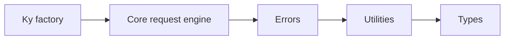

# Architecture: sindresorhus/ky

## Overview

The public API is a ky factory function that creates Ky instances with merged default options and method shortcuts. The Ky class normalizes input/options, builds a Request, runs hooks, manages retries and timeouts, and returns a ResponsePromise with body helper methods. Errors are surfaced through dedicated error types and hook customization.

## System Diagram

## Components

### Ky factory

**Directory:** `source/index.ts`

Builds ky instances, method shortcuts, and exposes stop/retry helpers.

### Core request engine

**Directory:** `source/core`

Implements option normalization, hook execution, fetch/timeout, retries, and response decoration.

### Errors

**Directory:** `source/errors`

Defines HTTPError, TimeoutError, and related error types.

### Utilities

**Directory:** `source/utils`

Shared helpers for merging options, body/stream handling, and normalization.

### Types

**Directory:** `source/types`

Public TypeScript types for options, hooks, and response promises.

## Data Flow

Caller invokes ky()/ky.get(), defaults are merged, a Ky instance builds a Request, beforeRequest hooks run, fetch executes with timeout handling, afterResponse hooks can modify/force retries, retry logic decides backoff, and a ResponsePromise exposes body helpers.

## Key Abstractions

- **KyInstance**: Callable instance with method shortcuts and factory helpers.
- **ResponsePromise**: Promise-like response with .json/.text/.formData helpers.
- **Hooks**: beforeRequest, beforeRetry, beforeError, afterResponse lifecycle extensions.
- **Retry options**: Configurable retry limits, status codes, delays, and custom shouldRetry logic.

## Entrypoints

| Path | Type | Description |
|------|------|-------------|
| `source/index.ts` | library | Exports the ky factory, helpers, and public types. |

## Where to Change What

| Task | Location |
|------|----------|
| Add a new feature | `source` |
| Add tests | `test` |
| Modify build | `package.json` |
| Update CI | `.github/workflows/main.yml` |

---
*Generated by [Repo Bootcamp](https://github.com/repo-bootcamp)*
